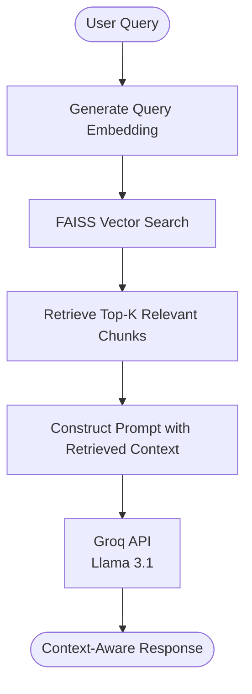
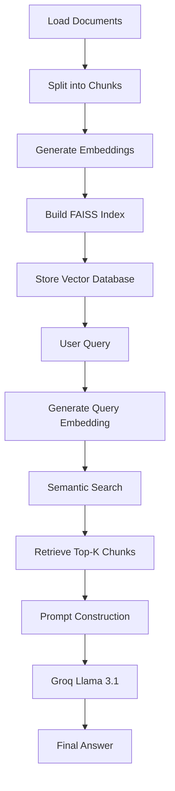

# 🧠 Universal Document RAG System using Groq API

A high-performance **Retrieval-Augmented Generation (RAG)** system that enables users to ask natural language questions over their own documents. The application retrieves the most relevant information using **semantic vector search** and generates accurate, context-aware responses using **Groq-hosted Llama 3.1** models.

Designed with a modular architecture, this project serves as a foundation for building AI-powered document assistants, enterprise knowledge bases, research assistants, and intelligent search systems.

---

## ✨ Features

- 📄 Supports multiple document formats (PDF, TXT, JSON)
- 🔍 Semantic search using Sentence Transformers
- ⚡ Ultra-fast inference powered by Groq API
- 🧠 Retrieval-Augmented Generation (RAG) for grounded responses
- 📚 Automatic document chunking and embedding generation
- 💾 High-speed similarity search using FAISS
- 🔐 Secure API key management with `.env`
- 🏗️ Modular and scalable project architecture
- 💻 Interactive CLI chat interface
- 🚀 Easy to extend with additional document formats

---

## 🏗️ Architecture Overview



---

## 🔄 RAG Workflow



---

## 🛠️ Tech Stack

| Component | Technology | Purpose |
|-----------|------------|---------|
| Language | Python | Core development |
| Embeddings | Sentence Transformers | Semantic vector embeddings |
| Vector Database | FAISS | Fast similarity search |
| Large Language Model | Llama 3.1 | Context-aware response generation |
| LLM Inference | Groq API | Low-latency inference |
| Environment Variables | python-dotenv | Secure API key handling |

---

## 📁 Project Structure

```text
doc_RAG/
│
├── core/
│   ├── embedder.py          # Embedding model
│   ├── vector_db.py         # FAISS index operations
│   ├── retriever.py         # Semantic retrieval
│   └── groq_llm.py          # Groq API integration
│
├── loaders/
│   ├── __init__.py
│   ├── json_loader.py
│   ├── pdf_loader.py
│   └── text_loader.py
│
├── data/
│   ├── colleges.json
│   ├── college_from_js.json
│   ├── sample.txt
│   └── document.pdf
│
├── build_index.py           # Builds the vector database
├── rag_chat.py              # Interactive chatbot
├── requirements.txt
├── .env
└── README.md
```

---

# ⚙️ Installation

### 1️⃣ Clone the Repository

```bash
git clone https://github.com/your-username/universal-document-rag.git

cd universal-document-rag
```

---

### 2️⃣ Install Dependencies

```bash
pip install -r requirements.txt
```

---

### 3️⃣ Configure Environment Variables

Create a `.env` file in the project root.

```env
GROQ_API_KEY=your_groq_api_key_here
```

> **⚠️ Never commit your `.env` file to GitHub.**

---

### 4️⃣ Build the Vector Database

```bash
python build_index.py
```

Expected Output:

```text
Loading documents...
Generating embeddings...
Creating FAISS index...
Vector database built successfully.
```

---

### 5️⃣ Launch the Chat Interface

```bash
python rag_chat.py
```

---

## 💬 Example Usage

### Query

```text
Where is Ariyalur Engineering College located?
```

### Response

```text
Ariyalur Engineering College is located at:

NH-227, Trichy–Chidambaram Highway,
Karuppur-Senapathy Post,
Ariyalur District,
Tamil Nadu.
```

---

## 🎯 Applications

- 📚 Document Question Answering
- 🏢 Enterprise Knowledge Bases
- 🎓 Educational Assistants
- 📑 Research Paper Search
- ⚖️ Legal Document Analysis
- 🏥 Healthcare Knowledge Systems
- 🤖 AI-powered Internal Chatbots

---

## 🚀 Future Enhancements

- 🌐 Streamlit or FastAPI Web Interface
- 🗂️ Support for DOCX, CSV, and HTML documents
- 📤 Drag-and-drop document upload
- 💬 Multi-turn conversation memory
- 🔄 Incremental vector indexing
- 📖 Source citations with confidence scores
- 🖼️ OCR support for scanned PDFs
- 🌍 Multilingual document support
- ☁️ Integration with Pinecone, ChromaDB, and Milvus

---

## 🤝 Contributing

Contributions, issues, and feature requests are welcome!

1. Fork the repository
2. Create a feature branch
3. Commit your changes
4. Push to your branch
5. Open a Pull Request

---

## 📜 License

This project is licensed under the **MIT License**.

---

## ⭐ Support

If you found this project useful, please consider giving it a **⭐ Star** on GitHub.

Your support helps improve the project and encourages future development.
